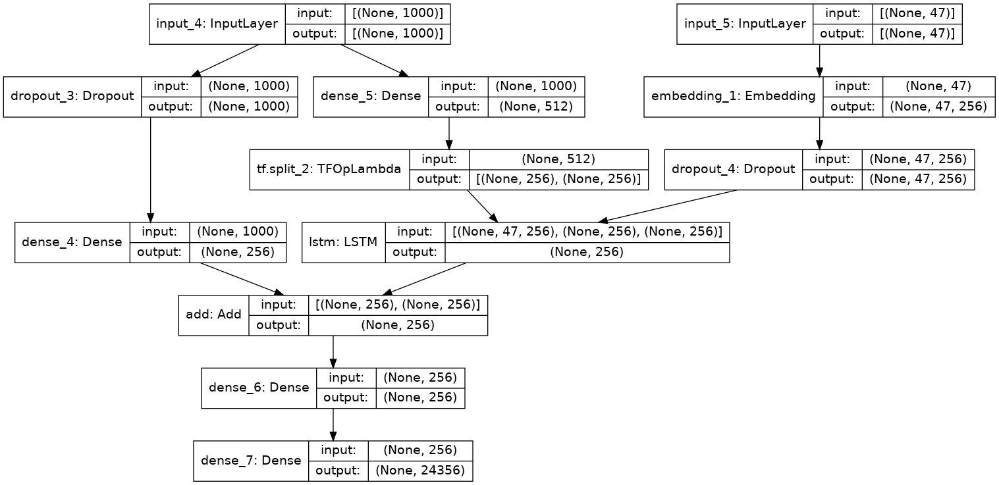

# Image Description

  
  

An application that generates live commentary for sports events from
streaming images, employing image recognition and NLP.
  

## Specifications

  

- Dataset : MS COCO 2014

  

- Dataset link : https://cocodataset.org/

  

- Image Datasize : 1,25,000

  

- Trainable Parameters : 13,855,013

  

- Layers : 12

  
 

### Model Architecture :

  

>  
